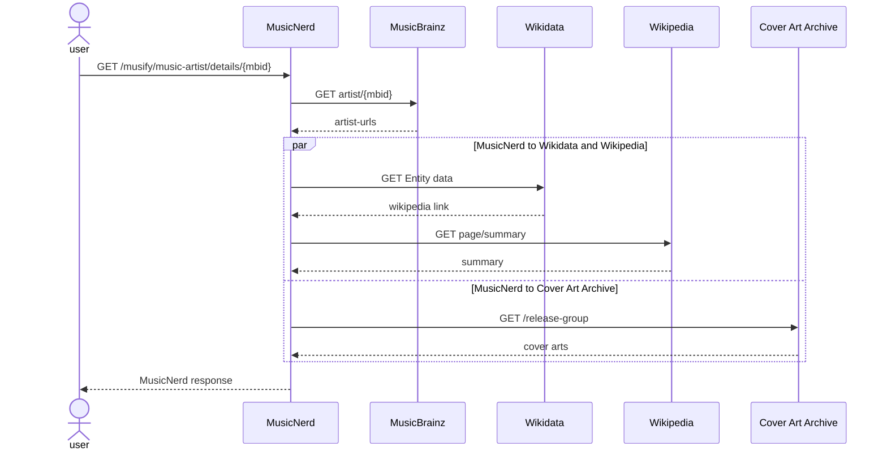

# Music Nerd

Get that info on that artist with this remarkable service that collects data from not less than 4 services on the internet!

## Linking information

Given the `MBID (MusicBrainz Identifier)` MusicNerd will collect the information from `MusicBrainz` database. From that information the `Wikidata` service is queried to get the story on `Wikipedia`.

The `MusicBrainz` response is also used to find the cover art from `Cover Art Archive` database.

### Sequence diagram

The diagram illustrates the order of the service calls. Note the parallellism in the last calls. The `Wikidata` and `Wikipedia` calls are executed in parallell with the call to `Cover Art Archive`.

## Architecture

The service serves the needs of users from all over the world and needs to be there all the time. Therefore, the architecture must have the qualities to match these business goals.

### Scalability
The service is deployed behind auto-scaling load balancer that increase and decrease the number of instances as the load varies.

### Performance
Although the response times are depending on the services it uses, the `Cover Art Archive` service is called in parallell with `Wikidata` and `Wikipedia`. 

### Availability
The service is deployed in several availability zones across the world to ensure maximum availability.

The minimum number of instances in each zone is two, to ensure availability during maintenance.

### Security
The correctness and availability ot the information presented by the service is depending on the services used. 

MusicNerd will respond with a `Gateway Timeout (504)` when any of those services is not available.

All information is public and users are anonymous.

### Testability
The service is depending on 4 other services and those needs to be simulated in some way. 

### Maintainability
The service logs all errors and alarms are set up to monitor the logs. The alarms are sent to a dedicated Slack channel.

The service can run on a local machine and still present production data as it is public. Therefore, any issues can be examined locally.

### Usability
The service exposes a REST API publicly which is great, from an architectural standpoint on usability.
