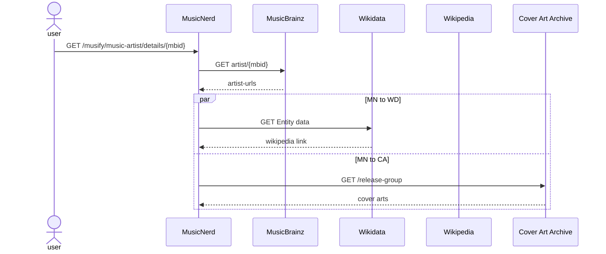

# Music Nerd

Get that info on that album with this remarkable service that collects data from not less than 4 services on the internet!

## Linking information

Given the MBID (MusicBrainz Identifier) MusicNerd will collect the information from `MusicBrainz` database. From that information the `Wikidata` service is queried to get the story on `Wikipedia`.

The `MusicBrainz` is also used to find the cover art from `Cover Art Archive` database.

### Sequence diagram

## Architecture

The Music Nerd to serve the needs of users from all over the world and needs to be there all the time. Therefore, the architecture must have the qualities to match these business goals.

### Scalability
The service is deployed behind auto-scaling load balancer that increase and decrease the number of instances as the load varies.

### Performance
Although the response times are depending on the services it uses, the `Cover Art Archive` service is called in parallell with `Wikidata` and `Wikipedia`. 

### Availability
The service is deployed in several availability zones across the world to ensure maximum availability.

The minimum number of instances in each zone is two, to ensure availability during maintenance.

### Security

The correctness and availability ot the information presented by the service is depending on the services used. MusicNerd will respond with a `Gateway Timeout (504)` when any of those services is not available.

